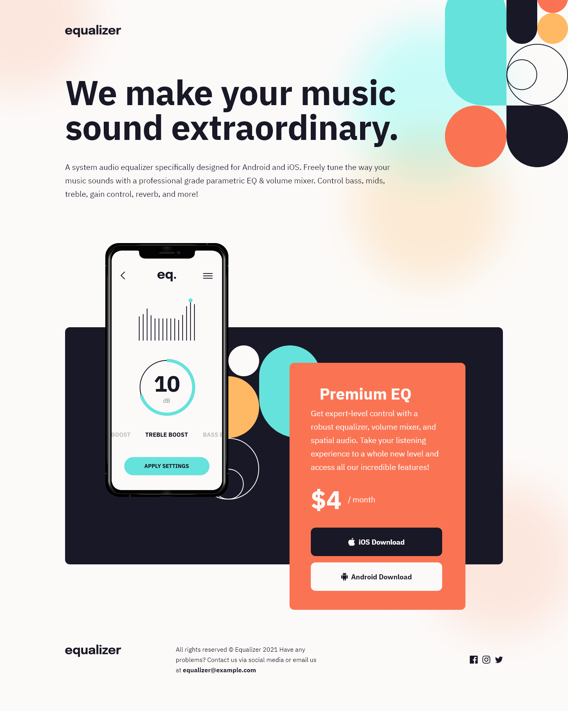

# Frontend Mentor - Equalizer landing page solution

This is a solution to the [Equalizer landing page challenge on Frontend Mentor](https://www.frontendmentor.io/challenges/equalizer-landing-page-7VJ4gp3DE). Frontend Mentor challenges help you improve your coding skills by building realistic projects.

### Screenshot

### Links

- Solution URL: [Solution URL here](https://github.com/NDK1195/equalizer-landing-page)
- Live Site URL: [Live site URL here](https://ndk1195.github.io/equalizer-landing-page/)

### Built with

- HTML5
- Tailwind CSS
